# Техническое задание

## Система пользовательских скинов для desktop-приложения «Яндекс Музыка» в стиле Winamp

| Параметр | Значение |
|---|---|
| Рабочее название | **YM Skins** (уточняется) |
| Версия документа | 1.1 (черновик для согласования) |
| Целевые платформы | Windows 10/11 (обязательно), macOS 12+ (опционально, отдельный этап) |
| Объект доработки | Официальное desktop-приложение «Яндекс Музыка» (Electron) |
| Прототип | Интерактивный прототип интерфейса и всех 12 скинов — папка `preview/` в репозитории, скриншоты — Приложение А |

**Изменения в версии 1.1**

- Интерфейс со скином стал минималистичным: в меню остаются только **Моя волна**, **Моя музыка**, **Поиск** и **Настройки** (раздел 5.1). Раздел «Главная» убран, стартовый экран — «Моя волна».
- Скины выбираются прямо в приложении: в Настройках появился раздел **«Оформление»** с окном примера и переключателем **«Оригинальная тема»** (раздел 5.2).
- Менеджер работает в фоне из трея и отвечает за внедрение, совместимость и обновления (раздел 5.3).
- Добавлено Приложение А со скриншотами прототипа.

---

## 1. Назначение и цели

### 1.1. Суть проекта

Нужно разработать программу-менеджер скинов (далее «Менеджер»). Она меняет внешний вид официального desktop-приложения «Яндекс Музыка» с помощью набора тем. Визуальная концепция — **скины в духе Winamp 2.x/5.x**: объёмные «железные» панели, LCD-дисплей с бегущей строкой, спектроанализатор и осциллограф, окно эквалайзера, компактный режим мини-плеера, пиксельные шрифты и скевоморфные кнопки.

Кроме оформления, скин делает интерфейс **минималистичнее оригинала**. В боковом меню остаются только четыре пункта: «Моя волна», «Моя музыка» (понравившиеся треки), «Поиск» и «Настройки». Настройки сохраняют всю оригинальную функциональность, к ним добавляется раздел «Оформление»: выбор скина с окном примера и включение оригинальной темы.

### 1.2. Цели

1. Выпустить **12 уникальных скинов** (минимум 10) с разной стилистикой, палитрой и анимациями.
2. Скины должны **продолжать работать после обновлений официального приложения**. Менеджер сам отслеживает обновление «Яндекс Музыки» и заново применяет скины. Совместимость с новой вёрсткой восстанавливается без переустановки Менеджера.
3. Менеджер и каталог скинов **обновляются автоматически**.
4. Архитектура должна позволять **добавлять новые скины и темы** в рамках дальнейшей поддержки без выпуска новой версии Менеджера.

### 1.3. Что не входит в проект

- Изменение функциональности приложения: обход подписки, скачивание треков, блокировка рекламы и т. п. **Запрещено.**
- Удаление функций Приложения. Скрытие пунктов меню (п. 5.1) — это изменение оформления: сами функции остаются в Приложении и возвращаются при включении оригинальной темы.
- Доступ к данным аккаунта пользователя, токенам, cookies. **Запрещено.**
- Мобильные приложения и веб-версия music.yandex.ru (можно рассмотреть отдельно).
- Распространение оригинальных графических ресурсов Winamp (см. раздел 13).

---

## 2. Термины

| Термин | Определение |
|---|---|
| **Приложение / YM** | Официальный desktop-клиент «Яндекс Музыка» |
| **Менеджер** | Разрабатываемая фоновая программа (в трее): внедрение скинов, контроль совместимости, обновления |
| **Скин** | Пакет оформления: стили, графика, шрифты, анимации, визуализатор, манифест |
| **Тема** | Цветовой вариант внутри скина (например, «Classic '98 — Green LCD» и «Classic '98 — Amber LCD») |
| **Инжектор** | Модуль Менеджера, который внедряет стили и скрипты скина в Приложение |
| **Карта селекторов (Selector Map)** | Отдельный файл соответствий между логическими элементами интерфейса («кнопка Play», «обложка», «прогресс-бар») и реальными CSS-селекторами конкретной версии Приложения |
| **Мини-плеер** | Отдельное компактное окно в стиле Winamp, которое управляет воспроизведением в Приложении |
| **Безопасный режим** | Режим, в котором при несовместимости применяется только цветовая схема без изменения разметки |
| **Оригинальная тема** | Стандартный вид Приложения: скин и минималистичное меню полностью отключены |
| **Окно примера** | Область в разделе «Оформление», где выбранный скин показывается до применения |

---

## 3. Исходные данные и анализ платформы

### 3.1. Что известно о Приложении

- Приложение построено на **Electron**: интерфейс — это веб-страница (HTML/CSS/JS), упакованная в архив `app.asar`.
- Приложение обновляется автоматически. Обновление **заменяет файлы**, поэтому любые изменения в `app.asar` пропадают.
- Классы CSS в сборке могут быть хешированными или генерируемыми. Они **могут меняться с каждым обновлением**.
- Пути установки ориентировочно такие (уточняются на этапе исследования):
  - Windows: `%LOCALAPPDATA%\Programs\YandexMusic\` (per-user установка);
  - macOS: `/Applications/Яндекс Музыка.app/Contents/Resources/`.

### 3.2. Этап исследования (Proof of Concept) — обязательный первый этап

Прежде чем разрабатывать скины, исполнитель должен проверить и задокументировать:

1. Какой способ внедрения рабочий (см. раздел 4.2): через протокол отладки Chromium или через патч `app.asar`.
2. Какие Electron Fuses включены в Приложении: проверка целостности ASAR, запрет флагов отладки и т. п.
3. Можно ли получить аудиоданные для визуализатора изнутри Приложения (Web Audio `AnalyserNode`). Если нет — проверить системный захват звука (loopback).
4. Как устроен механизм обновления Приложения: где хранится номер версии и как определить факт обновления.
5. На macOS: как модификация влияет на подпись кода и Gatekeeper.
6. Можно ли надёжно скрыть пункты бокового меню и встроить раздел «Оформление» в страницу настроек Приложения, не нарушая её работу.

**Результат этапа:** технический отчёт, работающий прототип (меняет цвет фона и одну кнопку, переживает перезапуск Приложения) и выбранная схема внедрения.

---

## 4. Архитектура

### 4.1. Состав системы

```
┌───────────────────────────── Компьютер пользователя ─────────────────────────────┐
│                                                                                  │
│  ┌──────────────── Менеджер (tray-приложение) ────────────────┐                  │
│  │ Трей-меню            │ Watcher версий YM · Updater         │                  │
│  │ Инжектор             │ Проверка совместимости (smoke)      │                  │
│  │ Мини-плеер (окно)    │ Аудио-источник визуализатора        │                  │
│  └───────────────┬──────┴─────────────────────────────────────┘                  │
│                  │ внедрение CSS/JS, команды управления                          │
│                  ▼                                                               │
│        ┌───────────────────────────────┐                                         │
│        │  Яндекс Музыка (Electron)     │                                         │
│        │  + слой скина (Skin Runtime)  │                                         │
│        │  + минималистичное меню       │                                         │
│        │  + «Оформление» в Настройках  │                                         │
│        └───────────────────────────────┘                                         │
└──────────────────────────────────────┬───────────────────────────────────────────┘
                                       │ HTTPS (только загрузка, подписанные файлы)
                     ┌─────────────────▼──────────────────┐
                     │  Сервер обновлений / CDN           │
                     │  • релизы Менеджера                │
                     │  • каталог скинов (catalog.json)   │
                     │  • карты селекторов по версиям YM  │
                     └────────────────────────────────────┘
```

### 4.2. Способ внедрения скинов

Рассматриваются два варианта. Окончательный выбор делается по итогам PoC.

| | **Вариант А (предпочтительный): протокол отладки Chromium (CDP)** | **Вариант Б (запасной): патч `app.asar`** |
|---|---|---|
| Принцип | Менеджер запускает YM с флагом `--remote-debugging-port` на `127.0.0.1` и внедряет CSS/JS через DevTools Protocol | Менеджер распаковывает `app.asar`, добавляет загрузчик скинов и упаковывает архив обратно |
| Файлы Приложения | Не изменяются | Изменяются |
| Поведение после обновления YM | Продолжает работать без дополнительных действий | Требует автоматического повторного патча |
| Риски | Флаг может быть отключён разработчиками YM. Порт отладки нужно защитить: только localhost, случайный порт | Проверка целостности ASAR, подпись на macOS, антивирусы |
| Как запускается YM | Через ярлык или автозапуск Менеджера. Штатный ярлык подменяется с согласия пользователя | Обычным образом |

Требования для обоих вариантов:

- Все изменения **полностью обратимы**. Кнопка «Восстановить оригинал» возвращает Приложение в исходное состояние.
- Перед любым патчем создаётся резервная копия оригинальных файлов, и проверяется её хеш.
- Менеджер не запрашивает права администратора, если YM установлено в профиль пользователя.

### 4.3. Слой совместимости (ключевое требование для работы после обновлений)

Скины **не обращаются к классам Приложения напрямую**. Для этого вводятся два уровня абстракции:

1. **Карта селекторов** (`selector-map/<версия YM>.json`) сопоставляет логические имена с реальными селекторами:

   ```json
   {
     "ymVersion": "5.x.y",
     "elements": {
       "player.bar":        "[data-test-id='PLAYERBAR_DESKTOP']",
       "player.play":       "[data-test-id='PLAY_BUTTON']",
       "player.cover":      "...",
       "player.title":      "...",
       "player.progress":   "...",
       "sidebar":           "...",
       "nav.wave":          "...",
       "nav.liked":         "...",
       "nav.search":        "...",
       "nav.settings":      "...",
       "nav.hidden":        ["...", "..."],
       "settings.page":     "...",
       "tracklist.row":     "..."
     },
     "critical": ["player.bar", "player.play", "player.title", "sidebar", "settings.page"]
   }
   ```

2. **Skin Runtime** — скрипт, который внедряется в Приложение. Он:
   - по карте селекторов проставляет элементам стабильные атрибуты (например, `data-yms="player.play"`) и следит за изменениями DOM через `MutationObserver`;
   - публикует CSS-переменные с данными состояния: текущий трек, прогресс, громкость, цвета обложки;
   - предоставляет скинам API: `onTrackChange`, `onPlayStateChange`, `getSpectrum()` и т. п.

Скины пишутся **только** против атрибутов `data-yms` и API Runtime. Когда вёрстка YM меняется, обновляется одна карта селекторов, а все скины продолжают работать без изменений.

---

## 5. Функциональные требования

### 5.1. Минималистичный интерфейс

Когда включён любой скин, Приложение показывается в упрощённом виде. В боковом меню остаются четыре пункта и «Настройки» внизу:

| Раздел | Что показывает | Источник в оригинальном Приложении |
|---|---|---|
| **Моя волна** (стартовый экран) | Сцена скина (обложка с визуализатором, проигрыватель, кассета и т. п.), текущий трек, кнопки «Слушать/Пауза» и «Нравится», выбор настроения, список «Дальше в волне» | «Моя волна» |
| **Моя музыка** | Понравившиеся треки: список, кнопка «Слушать все», снятие отметки «Нравится». Если треков нет — пустое состояние с переходом в «Мою волну» | «Коллекция → Мне нравится» |
| **Поиск трека** | Поле поиска по трекам, исполнителям и альбомам, недавние запросы, популярное, результаты, сообщение «Ничего не нашлось» | Оригинальный поиск |
| **Настройки** | Все оригинальные настройки плюс раздел «Оформление» (п. 5.2) | Оригинальные настройки |

Требования:

| № | Требование | Приоритет |
|---|---|---|
| I-1 | Остальные пункты меню оригинала («Главная», подкасты и книги, детский раздел, плейлисты в боковом меню и т. п.) скрываются. Функции Приложения не удаляются: переходы по прямым ссылкам и горячие клавиши продолжают работать | Must |
| I-2 | При запуске открывается «Моя волна» | Must |
| I-3 | Панель плеера одна для всех разделов: обложка, название и исполнитель, «Нравится», кнопки транспорта, перемотка, LCD-дисплей скина (время, бегущая строка, мини-визуализатор), громкость | Must |
| I-4 | Отметка «Нравится» на любом экране сразу отражается в «Моей музыке» | Must |
| I-5 | Скрытие разделов полностью обратимо: при включении оригинальной темы меню возвращается в исходный вид без перезапуска | Must |
| I-6 | Если пункты меню не найдены (несовместимая версия Приложения), минималистичное меню не применяется, и Приложение показывается с оригинальной навигацией (безопасный режим) | Must |

### 5.2. Настройки → «Оформление»

Раздел встраивается в оригинальную страницу настроек Приложения первым блоком. Остальные настройки (качество звука, нормализация громкости, переходы между треками, автозапуск, трей, язык и т. д.) сохраняют оригинальную функциональность и оформляются текущим скином.

| № | Требование | Приоритет |
|---|---|---|
| S-1 | Переключатель **«Оригинальная тема»**. Когда он включён, скин и минималистичное меню полностью отключаются, и Приложение выглядит стандартно. Выбранный скин запоминается и возвращается при выключении. Переключение происходит без перезапуска | Must |
| S-2 | Сетка из 12 скинов с миниатюрами. Применённый скин отмечен | Must |
| S-3 | **Окно примера**: при выборе скина в сетке справа показывается мини-плеер в этом скине с анимацией и описание скина. Само Приложение не меняется, пока пользователь не нажмёт «Применить» | Must |
| S-4 | Выбор цветовой темы скина в окне примера | Must |
| S-5 | Кнопка **«Применить скин»**: скин мгновенно применяется ко всему Приложению. Если выбран уже применённый скин, кнопка показывает «Скин применён» | Must |
| S-6 | Пока включена оригинальная тема, сетка скинов и окно примера неактивны | Must |
| S-7 | Дополнительные параметры скина: анимации вкл./выкл., интенсивность эффектов, тип визуализатора | Should |
| S-8 | Блок «Обновления скинов»: версия каталога, статус совместимости, кнопка «Проверить» | Must |
| S-9 | Если раздел «Оформление» не удалось встроить (несовместимая версия настроек), выбор скина и оригинальной темы доступен из меню трея (п. 5.3) | Must |

### 5.3. Менеджер (фоновый процесс)

Основной выбор скинов перенесён в Приложение (п. 5.2). Менеджер работает в фоне и отвечает за внедрение, совместимость и обновления.

| № | Требование | Приоритет |
|---|---|---|
| F-1 | Работа из системного трея, автозапуск вместе с ОС (отключаемый) | Must |
| F-2 | Меню трея: «Оригинальная тема» (вкл./выкл.), запасной выбор скина, «Проверить обновления», «Восстановить оригинал», «Выход» | Must |
| F-3 | Применение скина **без перезапуска YM** (горячая замена стилей) | Must |
| F-4 | «Восстановить оригинал» — полное снятие всех изменений и возврат Приложения в исходное состояние | Must |
| F-5 | Статус совместимости: «Совместимо» / «Безопасный режим» / «Ожидается обновление» — в трее и в разделе «Оформление» | Must |
| F-6 | Локализация: русский (обязательно), английский (желательно) | Must / Should |
| F-7 | Горячие клавиши: переключение скина, показ/скрытие мини-плеера | Should |
| F-8 | Импорт скина из локального файла (`.ymskin`) | Should |
| F-9 | Импорт классических скинов Winamp (`.wsz`) для мини-плеера (см. 6.4) | Could |
| F-10 | Режим «Сезонная тема» — автоматическая смена скина по календарю | Could |

### 5.4. Стилизация Приложения

Скин должен уметь оформлять:

- главное окно: фон, текстуры, рамки, скругления, тени;
- **панель плеера** — главный элемент в стиле Winamp: LCD-дисплей с бегущей строкой названия, цифровое табло времени, кнопки транспорта, ползунки громкости и перемотки в стиле «железа»;
- боковое меню, экраны «Моя волна», «Моя музыка», «Поиск» и «Настройки», списки треков, поле поиска, переключатели и кнопки;
- скроллбары, всплывающие меню, подсказки, модальные окна;
- шрифты, включая встраиваемые пиксельные и LCD-шрифты со свободной лицензией. Шрифты должны поддерживать кириллицу, либо для неё подбирается совместимый запасной шрифт.

### 5.5. Визуализатор (обязательная часть Winamp-стилистики)

| № | Требование |
|---|---|
| V-1 | Режимы: спектроанализатор (столбики с «пиками»), осциллограф, VU-метры (стрелочные и LED), «выключен» |
| V-2 | Частота отрисовки — 30–60 FPS, `canvas`/WebGL. Отрисовка останавливается, когда окно свёрнуто или музыка на паузе |
| V-3 | Источник данных: Web Audio `AnalyserNode` внутри Приложения. Если он недоступен — системный захват звука (Windows: WASAPI loopback; macOS: ScreenCaptureKit / виртуальный аудиодрайвер — уточняется в PoC) |
| V-4 | Каждый скин задаёт свои цвета, форму столбиков и место размещения визуализатора |
| V-5 | Если аудиоданных нет, визуализатор скрывается или показывает декоративную анимацию. Ошибок не возникает |

### 5.6. Мини-плеер в стиле Winamp

Отдельное компактное окно без системной рамки (как классический Winamp 275×116 px с масштабом ×1/×2):

| № | Требование | Приоритет |
|---|---|---|
| M-1 | Дисплей трека, таймер, визуализатор, кнопки транспорта, громкость, перемотка | Must |
| M-2 | Управление воспроизведением в YM через Runtime API | Must |
| M-3 | Режимы «поверх всех окон», «прилипание» к краям экрана, перетаскивание за любую область | Must |
| M-4 | Окно «эквалайзера» в классическом виде. Если реальная эквализация недоступна через API, окно выполняет декоративную и визуальную функцию. Это требует согласования; реальный EQ — через Web Audio `BiquadFilterNode`, если PoC подтвердит доступ к аудиографу | Should |
| M-5 | «Оконный» режим: плеер + эквалайзер + плейлист, которые стыкуются друг с другом (как в Winamp 2.x) | Could |
| M-6 | Сворачивание в «полоску» (windowshade mode) | Should |

### 5.7. Отслеживание обновлений Приложения

| № | Требование |
|---|---|
| U-1 | Менеджер отслеживает версию YM: при запуске Менеджера, при запуске YM и через наблюдение за файлами установки (изменение `app.asar` / метаданных версии) |
| U-2 | Когда обнаружена новая версия YM: <br>1) запросить с сервера карту селекторов для этой версии;<br>2) (вариант Б) заново применить патч;<br>3) запустить **smoke-тест**: проверить, что все `critical`-элементы находятся в DOM;<br>4) если тест прошёл — применить скин полностью, если нет — включить **безопасный режим** и уведомить пользователя |
| U-3 | Если для новой версии нет карты, Менеджер пробует карту предыдущей версии и проверяет её smoke-тестом |
| U-4 | Необязательная анонимная отправка отчёта о несовместимости (версия YM, список ненайденных элементов) — **только с согласия пользователя**, без персональных данных |
| U-5 | Когда на сервере появляется исправленная карта селекторов, Менеджер сам загружает её и возвращает скин в полный режим, без участия пользователя |
| U-6 | Процедура ни при каких обстоятельствах не должна ломать YM. Если внедрение не удалось, Приложение работает в оригинальном виде |

### 5.8. Автообновление Менеджера и скинов

| № | Требование |
|---|---|
| A-1 | Менеджер проверяет обновления при запуске и затем раз в N часов (настраивается) |
| A-2 | Отдельные каналы обновлений: **Менеджер** (исполняемый файл), **каталог скинов**, **карты селекторов**. Скины и карты обновляются без обновления Менеджера |
| A-3 | Все загружаемые файлы подписаны (Ed25519/minisign или встроенный механизм updater). Неподписанные файлы отклоняются |
| A-4 | Обновления применяются в фоне. Менеджер обновляется с подтверждением пользователя или автоматически (настройка) |
| A-5 | Откат: если после обновления скина возникает ошибка, восстанавливается предыдущая версия |
| A-6 | Каналы `stable` и `beta` (для тестировщиков) |

---

## 6. Требования к скинам

### 6.1. Общие требования к каждому скину

- Оригинальная авторская графика в стилистике эпохи Winamp. **Прямое копирование чужих скинов и логотипов запрещено.**
- Оформлены все экраны из п. 5.1 и 5.4 (Моя волна, Моя музыка, Поиск, Настройки), визуализатор и мини-плеер. Каждый скин показывается в окне примера (п. 5.2).
- Минимум **2 цветовые темы** на скин.
- Анимации отключаются и учитывают системную настройку `prefers-reduced-motion`.
- Текст читается: контраст основного текста — не ниже WCAG AA (4.5:1). Декоративные LCD-элементы — исключение.
- Корректный вид при масштабе окна от минимального размера YM до 4K, при масштабировании Windows 100–200 %.
- Скин не должен увеличивать нагрузку на CPU более чем на 5 процентных пунктов относительно оригинала при воспроизведении (замер на эталонном ПК, см. 8).

### 6.2. Перечень скинов (12 шт.)

| № | Название (рабочее) | Концепция | Ключевые визуальные элементы | Анимация |
|---|---|---|---|---|
| 1 | **Classic '98** | Дань классическому Winamp 2.x | Тёмно-серый «металл» с фаской, зелёный LCD, пиксельный шрифт, кнопки-«кирпичики» | Бегущая строка, спектр с «падающими пиками» |
| 2 | **Chrome Modern** | Эпоха Winamp 3/5 Modern Skins | Хром, скруглённые формы, стеклянные вставки, голубая подсветка | Блики по хрому при наведении, плавные переходы |
| 3 | **Hi-Fi Deck** | Кассетная дека / ресивер 80-х | Шлифованный алюминий, стрелочные VU-метры, «крутилки», лампочки индикаторов | Стрелки VU реагируют на звук, вращение катушек кассеты |
| 4 | **Vinyl Turntable** | Проигрыватель пластинок | Дерево и латунь, обложка на вращающейся пластинке, тонарм | Вращение пластинки, тонарм движется по прогрессу трека |
| 5 | **Synthwave '84** | Ретро-футуризм | Закатный градиент, неоновая сетка, хромированный шрифт | Сетка «уезжает» к горизонту, пульсация неона в такт |
| 6 | **Neon Cyber** | Киберпанк | Чёрный фон, розовый/циан неон, глитч-эффекты | Глитч при смене трека, свечение по биту |
| 7 | **Terminal CRT** | Ламповый монитор / хакерский терминал | Моноширинный шрифт, зелёный или янтарный фосфор, ASCII-рамки | Скан-линии, мерцание, «печатающийся» текст названия |
| 8 | **Aqua Jelly** | Интерфейсы начала 2000-х (glossy) | «Желейные» полупрозрачные кнопки, полоски, капли | Пульсация кнопки Play, переливы глянца |
| 9 | **Aero Glass** | Эпоха «стеклянных» интерфейсов | Размытое стекло, мягкие градиенты, природные обои | Плавный параллакс фона, мягкие отражения |
| 10 | **8-Bit Arcade** | Игровые консоли и аркадные автоматы | Пиксель-арт, палитра 8/16 бит, пиксельные иконки | Спрайтовые анимации, «монетка» при лайке трека |
| 11 | **Winter Lodge** (сезонный) | Новогодний / зимний | Дерево, снег, гирлянды, тёплый свет | Падающий снег, мигание гирлянд в такт |
| 12 | **Cover Adaptive** | Современная интерпретация | Минималистичный «плеер-коробка», цвета берутся с обложки текущего трека | Плавная смена палитры при смене трека |

Состав и названия согласовываются с Заказчиком на этапе дизайна (раздел 11, этап 2). Можно заменить до 3 концепций без изменения объёма работ. Как выглядит каждый скин в минималистичном интерфейсе — см. Приложение А.

### 6.3. Формат пакета скина

Файл `.ymskin` — это ZIP-архив:

```
my-skin.ymskin
├── manifest.json        # метаданные, версия, совместимость, темы, настройки
├── skin.css             # стили против data-yms и CSS-переменных Runtime
├── themes/
│   ├── green.css
│   └── amber.css
├── assets/              # PNG/SVG/WebP-спрайты, текстуры
├── fonts/               # только шрифты со свободной лицензией (OFL и т. п.)
├── visualizer.js        # (опц.) кастомный визуализатор, выполняется в песочнице
├── miniplayer/          # оформление мини-плеера
└── preview/             # скриншоты и анимированное превью для каталога
```

Пример `manifest.json`:

```json
{
  "id": "classic-98",
  "name": "Classic '98",
  "version": "1.2.0",
  "author": "YM Skins Team",
  "runtimeApi": "^1.0",
  "themes": [
    { "id": "green", "name": "Green LCD" },
    { "id": "amber", "name": "Amber LCD" }
  ],
  "settings": [
    { "id": "animations", "type": "boolean", "default": true },
    { "id": "visualizer", "type": "enum", "values": ["spectrum", "oscilloscope", "vu", "off"], "default": "spectrum" }
  ]
}
```

Требования к формату:

- Формат документируется (`SKIN_FORMAT.md`), чтобы в будущем подключать сторонних авторов.
- JS скина выполняется в ограниченном контексте. Доступны только Runtime API. Сетевые запросы, `eval`, доступ к cookies и `localStorage` Приложения запрещены. Скины из официального каталога проходят ревью.

### 6.4. Импорт классических скинов Winamp (опционально, F-9)

- Поддержка формата `.wsz` (Winamp 2.x Classic: `main.bmp`, `cbuttons.bmp`, `titlebar.bmp`, `text.bmp`, `numbers.bmp`, `eqmain.bmp`, `viscolor.txt` и др.) **только для окна мини-плеера**.
- В качестве ориентира можно использовать открытую реализацию [Webamp](https://github.com/captbaritone/webamp) (лицензия MIT) с соблюдением её условий.
- Менеджер не распространяет чужие `.wsz`. Пользователь загружает их сам.

---

## 7. Технологический стек (рекомендуемый)

| Компонент | Технология | Обоснование |
|---|---|---|
| Менеджер | **Tauri 2** (Rust + TypeScript/React UI) | Небольшой размер (единицы МБ), кроссплатформенность, встроенный подписанный updater, трей |
| Альтернатива Менеджера | Electron | Если нужна максимальная скорость разработки UI. Размер больше |
| Инжектор (вариант А) | Chrome DevTools Protocol через WebSocket (Rust `tokio-tungstenite` или аналог) | Без изменения файлов YM |
| Инжектор (вариант Б) | Работа с ASAR (`@electron/asar` или Rust-реализация) | Запасной вариант |
| Skin Runtime | TypeScript, `MutationObserver`, Web Audio API | Работает внутри YM |
| Визуализатор | Canvas 2D / WebGL | Производительность |
| Системный захват звука | Windows: WASAPI loopback; macOS: ScreenCaptureKit | Запасной источник аудио |
| Сервер обновлений | Статический CDN / GitHub Releases / S3 + JSON-манифесты | Бэкенд не требуется |
| Подпись обновлений | Ed25519 (minisign / Tauri updater) | Защита от подмены |
| Установщик | Windows: NSIS/MSI с подписью кода (сертификат Authenticode). macOS: `.dmg` с подписью Developer ID и нотаризацией | Меньше ложных срабатываний антивирусов и Gatekeeper |
| CI/CD | GitHub Actions / GitLab CI | Сборка, подпись, публикация, автотесты |

Сертификаты подписи кода (Windows Authenticode, Apple Developer ID) приобретает **Заказчик** или они приобретаются за его счёт.

---

## 8. Нефункциональные требования

| Категория | Требование |
|---|---|
| Производительность | Применение скина — не дольше 1 с. Потребление RAM Менеджером в фоне — ≤ 80 МБ. Холостой CPU Менеджера — < 1 % |
| Эталонный ПК | 4-ядерный CPU уровня Intel Core i5 8-го поколения, 8 ГБ RAM, встроенная графика, Windows 10 22H2 |
| Надёжность | Сбой Менеджера или скина не приводит к падению YM. При ошибке Runtime стили скина снимаются автоматически |
| Безопасность | Порт CDP (вариант А) слушает только `127.0.0.1` и выбирается случайно. Менеджер не читает и не передаёт данные аккаунта. Все обновления подписаны и загружаются только по HTTPS |
| Приватность | Телеметрия выключена по умолчанию и включается явно. Персональные данные не собираются. Есть текст политики конфиденциальности |
| Совместимость ОС | Windows 10 (22H2) и 11, x64. macOS 12+ на Apple Silicon и Intel — на этапе macOS |
| Совместимость YM | Текущая стабильная версия на момент приёмки + автоматическая поддержка будущих версий через карты селекторов |
| Установка | Без прав администратора (per-user). Корректная деинсталляция возвращает YM в исходное состояние |
| Логи | Локальные логи с ротацией. Кнопка «Скопировать отчёт для поддержки» |

---

## 9. Тестирование

- **Автотесты Runtime**: юнит-тесты API, тесты разбора манифестов и карт селекторов.
- **Smoke-тест совместимости** запускается в CI: скачивается актуальная версия YM, проверяется карта селекторов, скины применяются, делаются скриншоты.
- **Визуальная регрессия**: скриншоты каждого скина и темы на ключевых экранах сравниваются с эталоном.
- **Ручное тестирование**: матрица «скин × тема × ОС × масштаб экрана». Проверка обновления YM «со старой версии на новую» при запущенном Менеджере.
- **Интерфейс**: в каждом скине работают все четыре раздела и настройки. Включение и выключение оригинальной темы полностью возвращает и снимает минималистичное меню. Окно примера не меняет Приложение до нажатия «Применить».
- **Производительность**: замер CPU/RAM/FPS для каждого скина на эталонном ПК.

---

## 10. Состав результатов (что передаётся Заказчику)

1. Исходный код Менеджера, Skin Runtime, инжектора и всех скинов в репозитории Заказчика.
2. Исходники дизайна: макеты в Figma (на основе прототипа из Приложения А), исходные спрайты и текстуры.
3. Подписанные установщики для Windows (и macOS на соответствующем этапе).
4. Настроенный конвейер CI/CD и инфраструктура обновлений (CDN, ключи подписи передаются Заказчику).
5. Документация:
   - `README.md` — сборка и запуск;
   - `SKIN_FORMAT.md` — формат скина и Runtime API для авторов;
   - `SELECTOR_MAP.md` — как обновлять карту селекторов после выхода новой версии YM;
   - `RELEASE.md` — процесс выпуска обновлений;
   - инструкция пользователя.

---

## 11. Этапы работ

Сроки этапов согласуются отдельно. Ниже приведены состав и результат каждого этапа.

| Этап | Содержание | Результат / критерий приёмки |
|---|---|---|
| **1. Исследование (PoC)** | Задачи из п. 3.2, выбор способа внедрения, проверка доступа к аудио | Отчёт + прототип, который меняет оформление и переживает перезапуск YM |
| **2. Дизайн** | Макеты 12 скинов на основе прототипа (Приложение А): экраны «Моя волна», «Моя музыка», «Поиск», «Настройки», панель плеера, мини-плеер | Утверждённые макеты в Figma |
| **3. Ядро** | Менеджер (трей), инжектор, Skin Runtime, карта селекторов, безопасный режим, минималистичное меню, раздел «Оформление» с окном примера и оригинальной темой | Выбор, предпросмотр, применение и снятие тестового скина из настроек Приложения. Smoke-тест работает |
| **4. Механизм обновлений** | Watcher версий YM, автообновление Менеджера, скинов и карт, подпись, откат | Эмуляция обновления YM → скин восстанавливается автоматически |
| **5. Визуализатор и мини-плеер** | Спектр, осциллограф, VU-метры, окно мини-плеера, эквалайзер | Работает в эталонном скине Classic '98 |
| **6. Производство скинов** | Вёрстка 12 скинов × 2+ темы, анимации | Все скины проходят чек-лист п. 6.1 |
| **7. Тестирование и релиз (Windows)** | Полная матрица тестов, подпись, публикация | Подписанный установщик, релиз в канал `stable` |
| **8. macOS** (опционально) | Адаптация инжектора и Менеджера, подпись и нотаризация | Релиз для macOS |
| **9. Импорт `.wsz`** (опционально) | Поддержка классических скинов Winamp в мини-плеере | Корректное отображение набора эталонных `.wsz` |

---

## 12. Дальнейшая поддержка

### 12.1. Состав поддержки

| Направление | Содержание |
|---|---|
| **Совместимость** | Мониторинг новых версий YM (автоматически в CI), обновление карт селекторов, исправление скинов |
| **Новый контент** | Выпуск новых скинов и тем по согласованному плану (например, N скинов за период поддержки), сезонные темы |
| **Исправление ошибок** | Разбор обращений пользователей и отчётов о несовместимости |
| **Развитие** | Новые функции Менеджера по отдельным заявкам |

### 12.2. Уровни обслуживания (SLA — значения согласуются)

| Событие | Реакция | Устранение |
|---|---|---|
| Новая версия YM ломает критичные элементы (скин в безопасном режиме) | [ ] ч | Обновлённая карта селекторов — в течение [ ] ч |
| YM не запускается или падает из-за Менеджера | [ ] ч | Хотфикс или отключение внедрения удалённым флагом — в течение [ ] ч |
| Визуальный дефект скина | [ ] рабочих дня | В ближайшем плановом обновлении |

### 12.3. Удалённый аварийный выключатель

В манифесте обновлений есть флаг `killSwitch` для конкретных версий YM. Если внедрение вызывает проблемы, флаг массово отключает скины у пользователей до выхода исправления.

---

## 13. Риски и юридические аспекты

| Риск | Влияние | Мера |
|---|---|---|
| Яндекс закроет флаг отладки (вариант А) или включит проверку целостности ASAR (вариант Б) | Критическое: внедрение невозможно | Поддерживать оба варианта. Мониторинг в CI. Заранее согласовать с Заказчиком план действий |
| Радикальный редизайн YM | Высокое: нужна переработка скинов | Слой абстракции `data-yms` снижает объём работ. Нужна оценка по факту |
| Изменение меню или страницы настроек YM | Среднее: минималистичное меню или раздел «Оформление» не встраиваются | Элементы вынесены в карту селекторов. Безопасный режим с оригинальным меню. Запасной выбор скина из трея (S-9) |
| Недоступность аудиоданных для визуализатора | Среднее | Системный захват звука. На крайний случай — декоративная анимация |
| Ложные срабатывания антивирусов (патчинг, внедрение) | Среднее | Подпись кода, отправка файлов в вендоры антивирусов, вариант А без изменения файлов |
| **Пользовательское соглашение Яндекса** может запрещать модификацию ПО | Юридическое | Заказчику рекомендуется получить юридическую оценку. Проект позиционируется как неофициальный, в интерфейсе есть предупреждение. Функции YM не изменяются, товарные знаки «Яндекс» не используются в названии и логотипе |
| **Товарный знак и графика Winamp** | Юридическое | Используется только стилистика. Логотипы, название Winamp и оригинальные bitmap-ресурсы в своих скинах не используются |
| Лицензии шрифтов и сторонних библиотек | Юридическое | Только OFL/MIT/Apache и аналогичные лицензии. Реестр лицензий в репозитории |

---

## 14. Вопросы к Заказчику

1. Нужна ли версия для macOS в первом релизе или она выносится в отдельный этап?
2. Как будет распространяться продукт: бесплатно, платно, по подписке на новые скины? От этого зависят лицензирование, платёжный модуль и защита контента.
3. Нужен ли личный кабинет или магазин скинов, или достаточно встроенного бесплатного каталога?
4. Планируется ли открывать формат для сторонних авторов (пользовательские скины, модерация)?
5. Нужен ли реальный эквалайзер или достаточно визуального?
6. Нужен ли импорт классических скинов `.wsz` (п. 6.4)?
7. Предпочтения по конкретным концепциям из п. 6.2: что оставить, что заменить?
8. Должны ли скрытые разделы («Главная», подкасты и т. п.) оставаться доступны хотя бы через поиск или прямые ссылки, или достаточно оригинальной темы?
9. Кто владеет инфраструктурой (домен, CDN, сертификаты подписи) и ключами подписи обновлений?
10. Какой объём нового контента и SLA нужны в рамках поддержки (раздел 12)?

---

## Приложение А. Визуализация (прототип)

Скриншоты сделаны в интерактивном прототипе (папка `preview/` репозитория). Интерфейс «Яндекс Музыки» в прототипе воспроизведён схематично, треки вымышленные.

### А.1. Экраны минималистичного интерфейса

**Моя волна** — скин Vinyl Turntable:

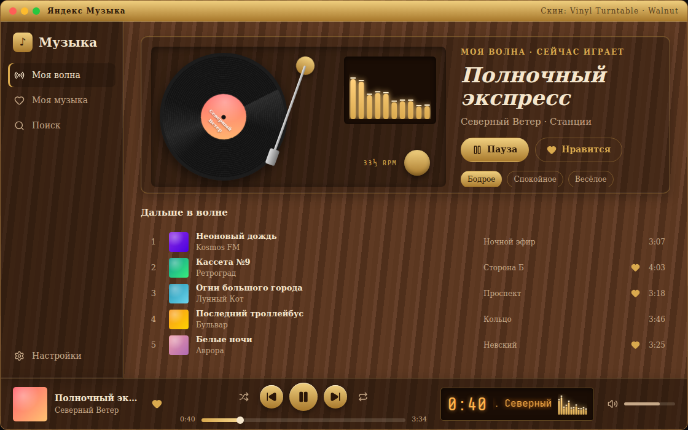

**Моя музыка** — скин Classic '98:

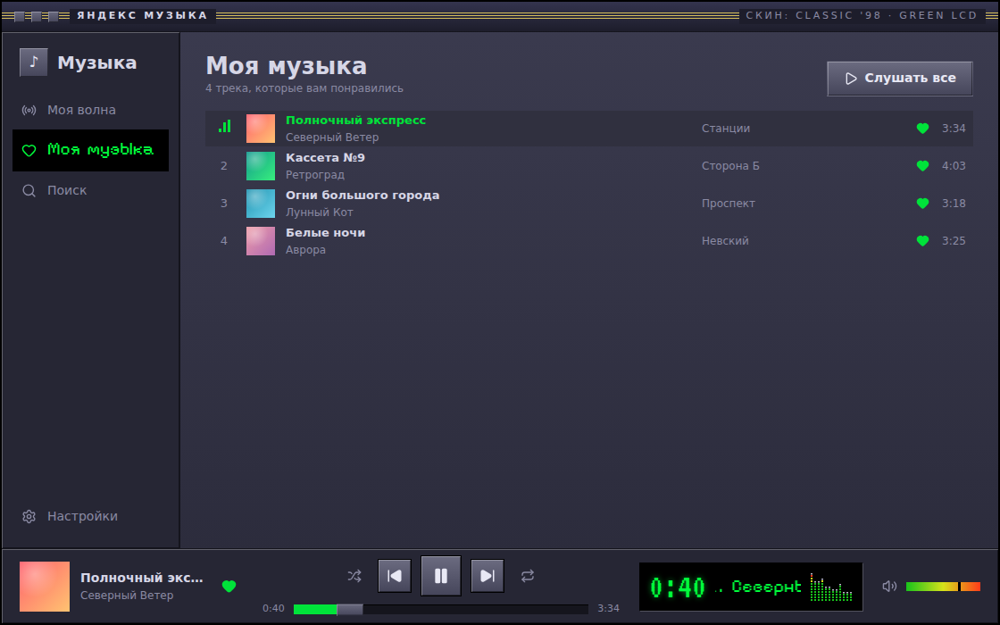

**Поиск трека** — скин Neon Cyber:

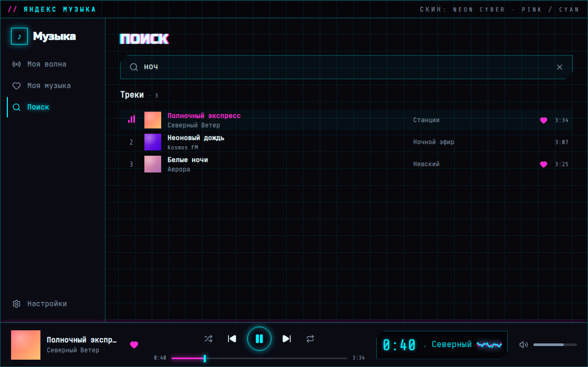

**Настройки → Оформление** — скин Aqua Jelly: сетка скинов, окно примера, выбор темы и кнопка «Применить»:

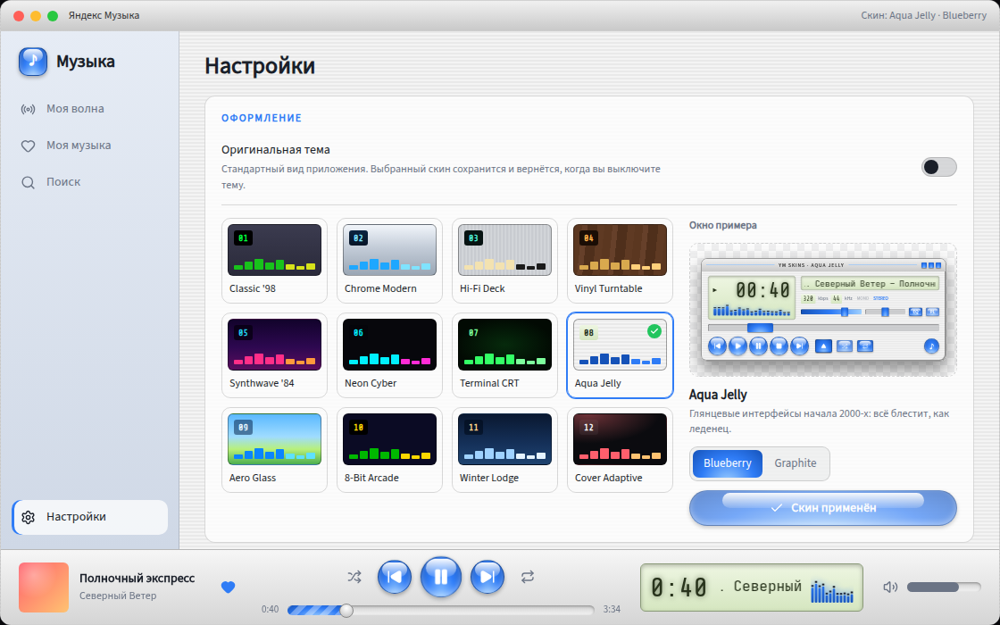

**Оригинальная тема включена** — скин отключён, выбор скинов неактивен:

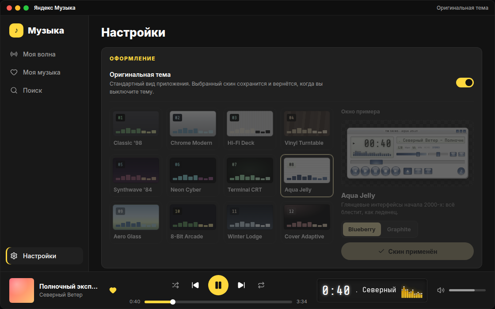

### А.2. Все 12 скинов на экране «Моя волна»

| | |
|---|---|
| 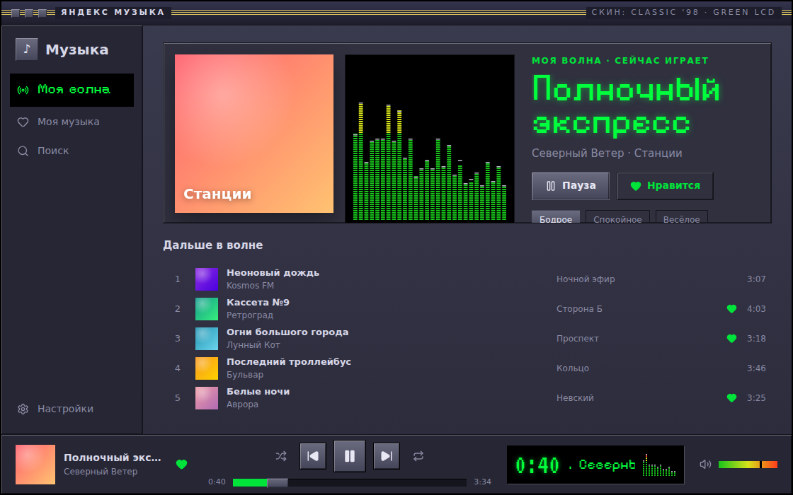<br>**1. Classic '98** | 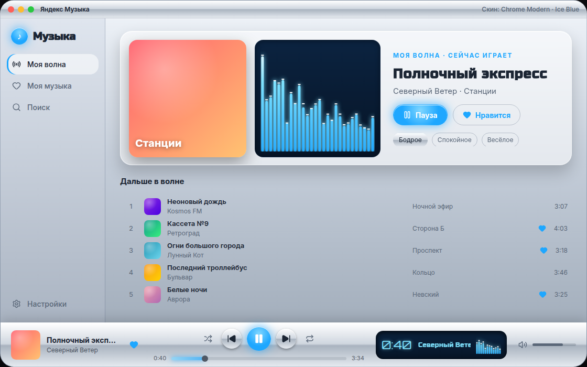<br>**2. Chrome Modern** |
| 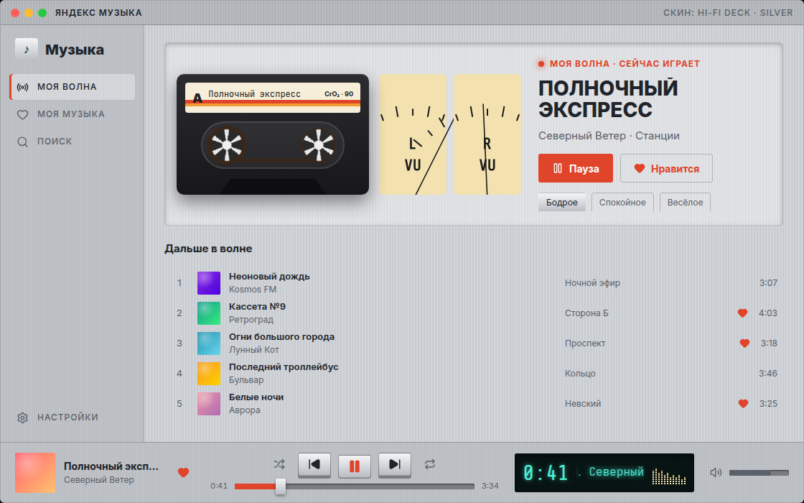<br>**3. Hi-Fi Deck** | <br>**4. Vinyl Turntable** |
| 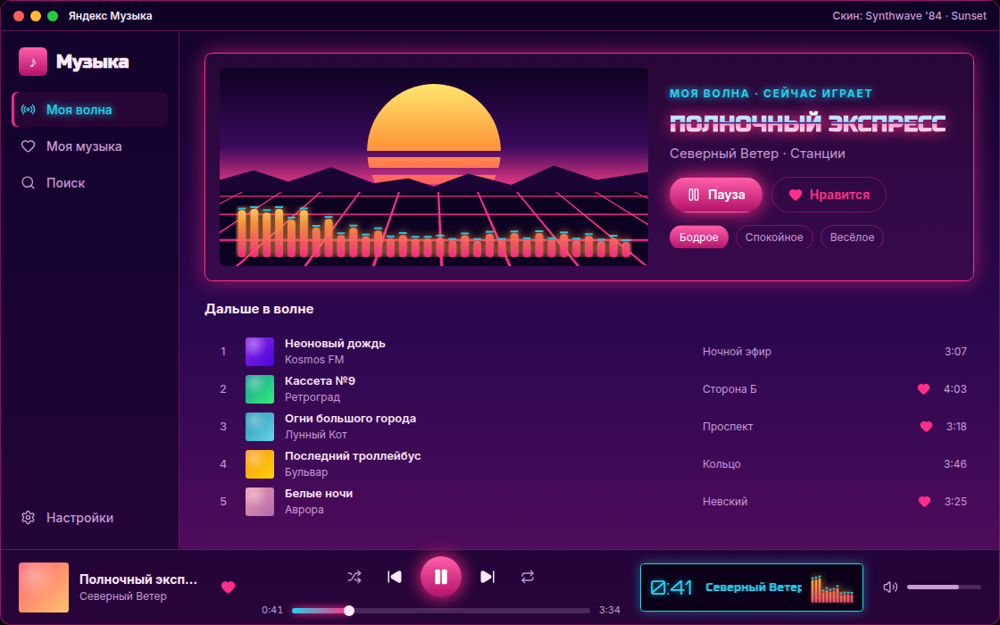<br>**5. Synthwave '84** | 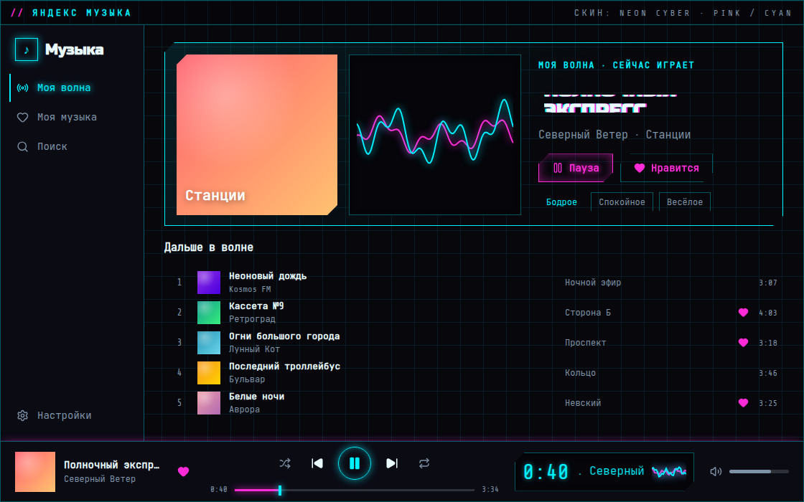<br>**6. Neon Cyber** |
| 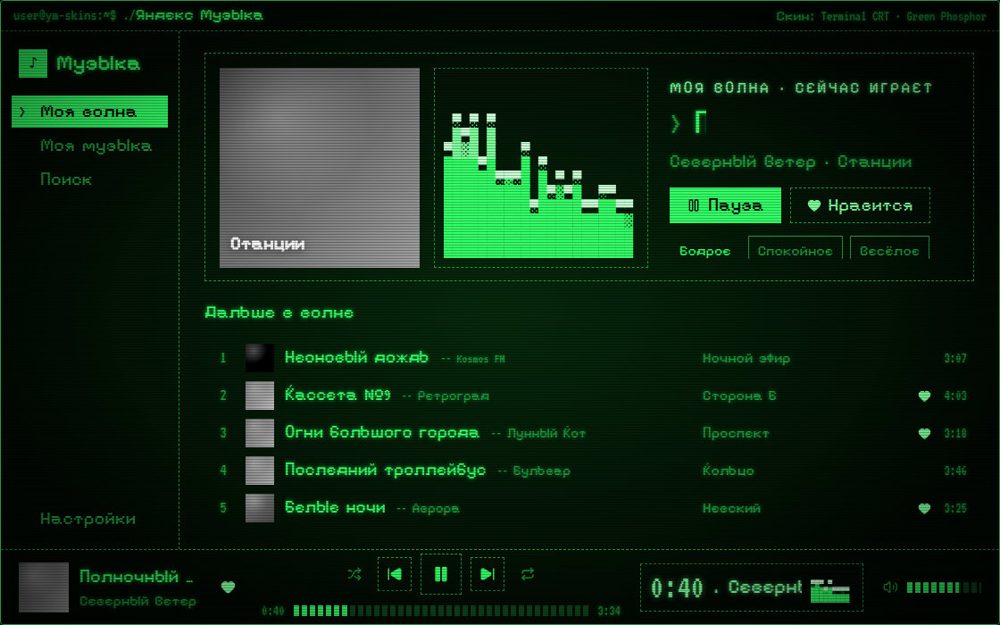<br>**7. Terminal CRT** | 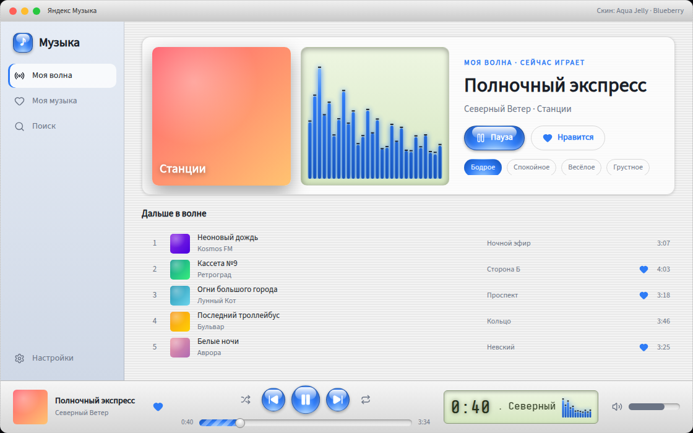<br>**8. Aqua Jelly** |
| 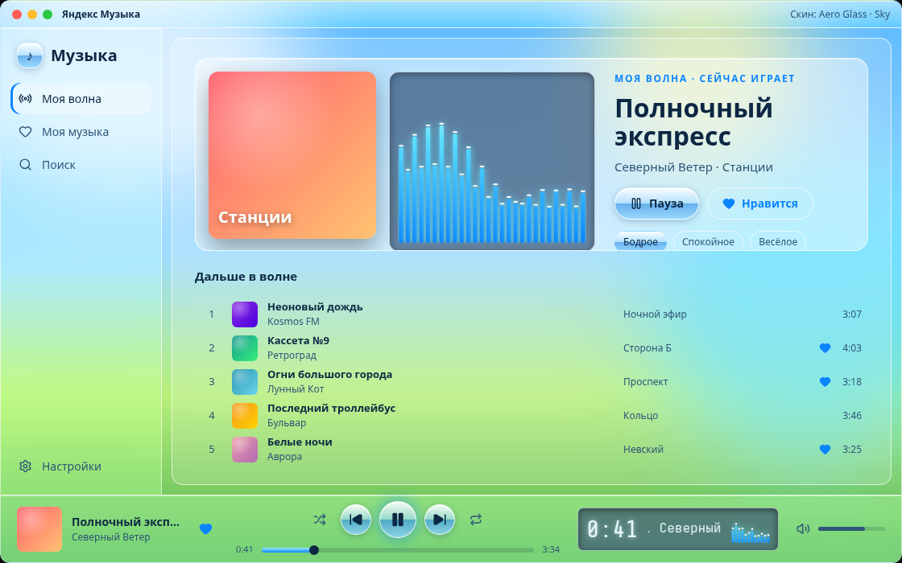<br>**9. Aero Glass** | 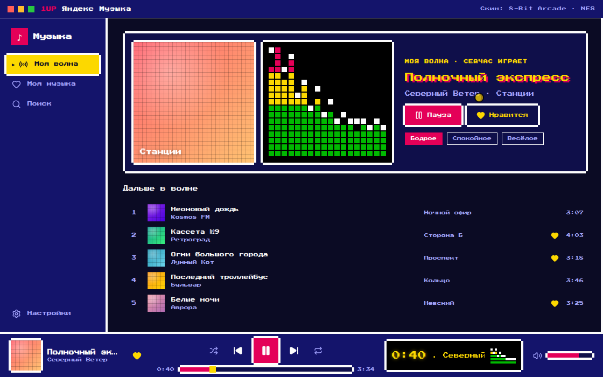<br>**10. 8-Bit Arcade** |
| 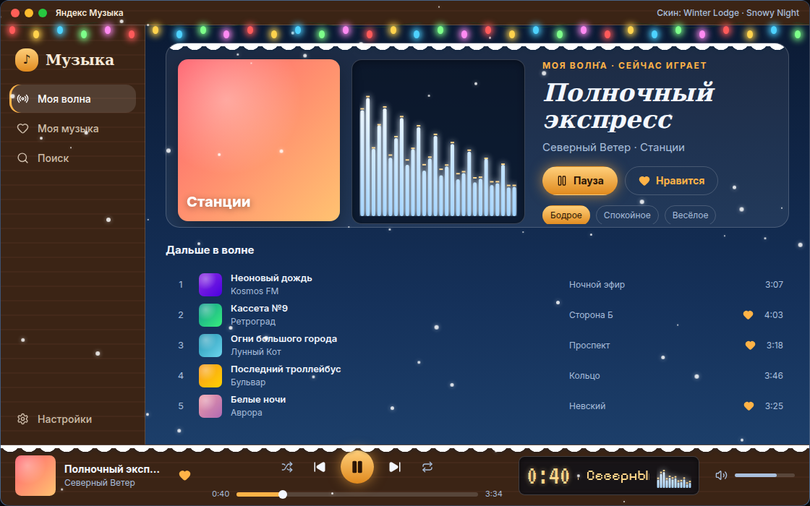<br>**11. Winter Lodge** | 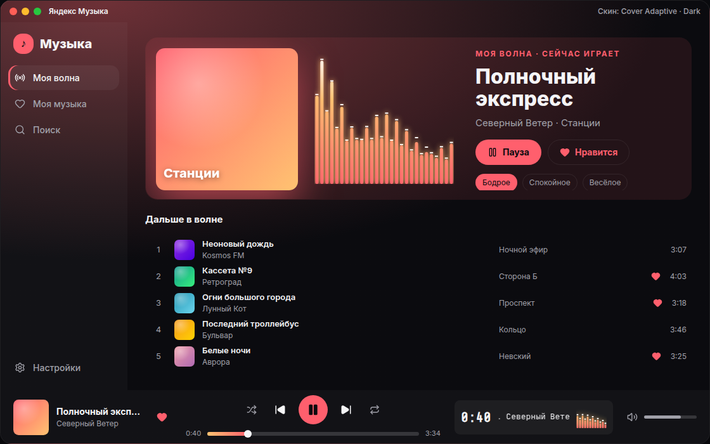<br>**12. Cover Adaptive** |

